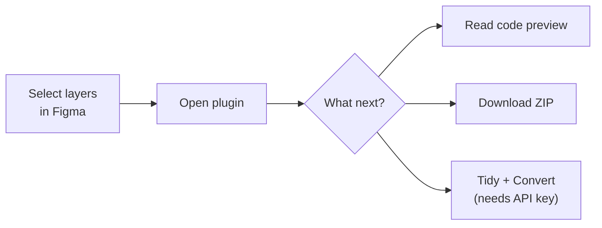
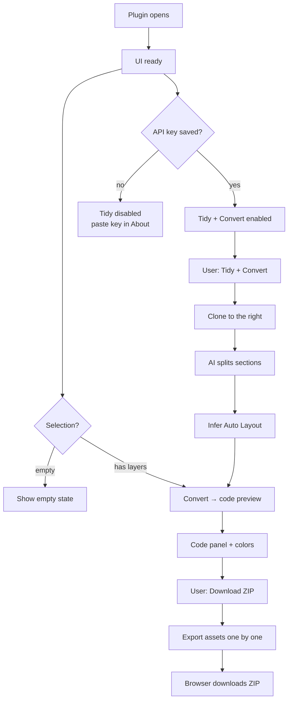
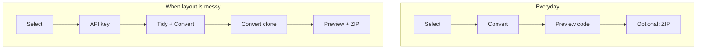
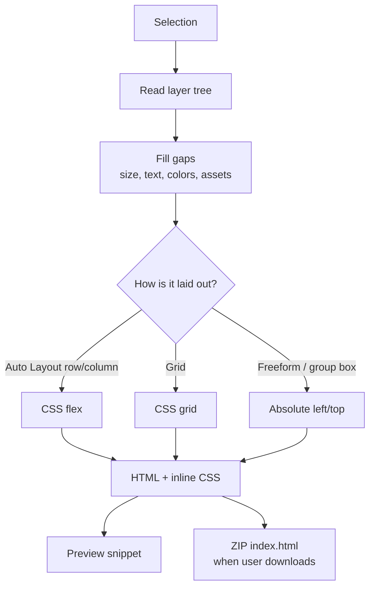
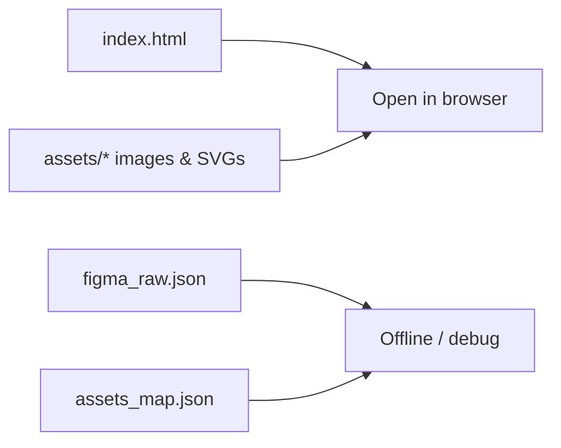
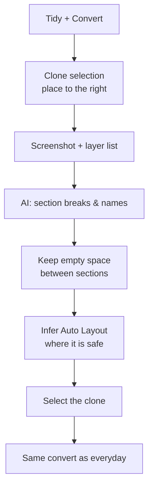
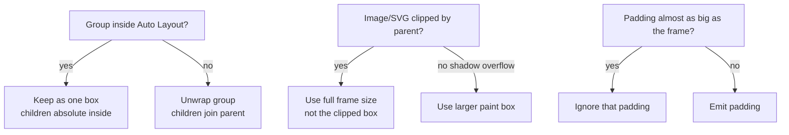
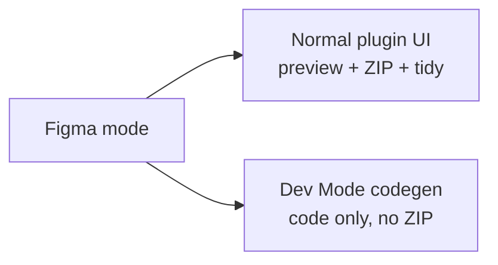

# Logic

How the plugin turns a Figma selection into HTML and a ZIP. Skim the diagrams first.

---

## What the user does

| Action                    | Result                                                |
| ------------------------- | ----------------------------------------------------- |
| Select / change selection | Live HTML preview updates (no image export yet)       |
| Download ZIP              | Full `index.html` + images/SVGs + JSON                |
| Tidy + Convert            | Clone → AI sections → Auto Layout tidy → then convert |
| About → Save key          | Enables Tidy + Convert                                |

---

## UX flow

---

## Two ways to get HTML

- **Everyday** — convert what is on the canvas as-is.
- **Tidied** — make a structured clone first (sections, gaps, Auto Layout), leave the original alone, convert the clone.

---

## Conversion logic (big picture)

---

## What goes in the ZIP

Preview and ZIP share the same HTML document. Images are only exported when you download the ZIP.

---

## Tidy + Convert logic

Original design is never modified. Re-run replaces the previous clone.

---

## Layout rules (when HTML looks wrong)

These rules keep pages from collapsing sideways (sidebar + footer only), squashing wide background images, or crushing buttons with bad import padding.

---

## Modes

