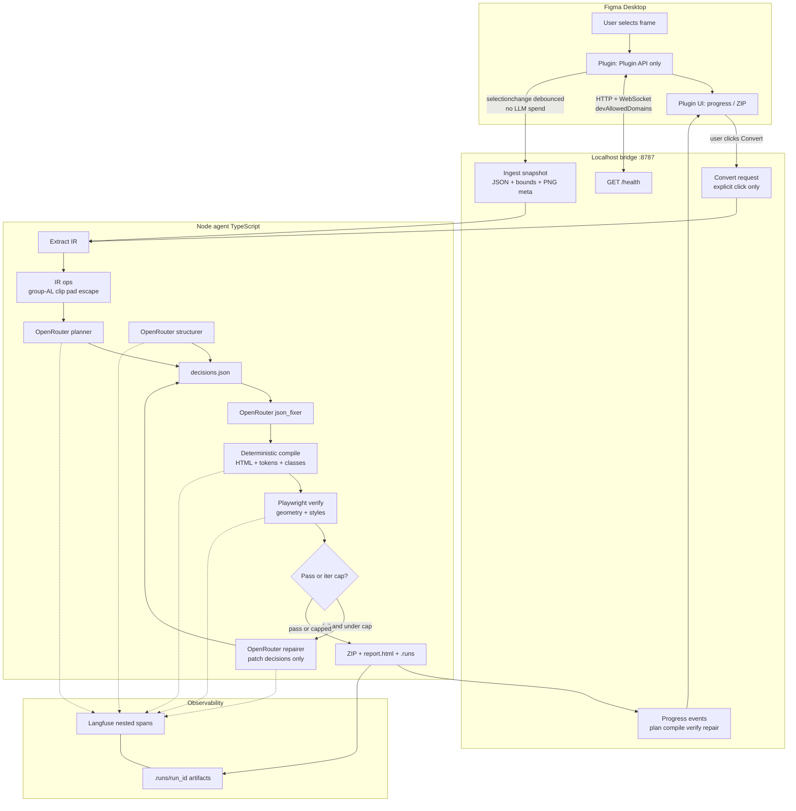
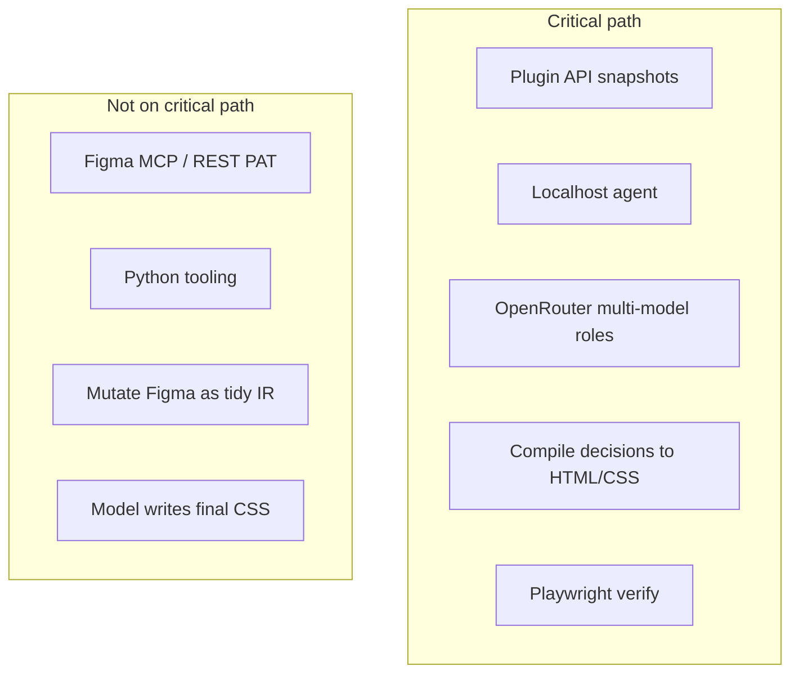

# All-in-one flow — new plan logic

One diagram for the whole system. Details: [README.md](./README.md) · [LOCAL-BRIDGE.md](./LOCAL-BRIDGE.md) · [STACK.md](./STACK.md).

---

## Runtime + convert loop

CI/fixtures use the same **Agent** path from disk (no Figma, no bridge). Figma MCP/REST is **not** on this path.

**Build phase order** lives only in [README.md](./README.md) (phase map) — not repeated here.

---

## What is in vs out

