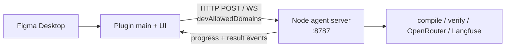

# Local bridge — Figma plugin ↔ Node agent

**Locked decision:** Development and v1 agent data path is **Plugin API → localhost → Node agent**.  
**Not used for this path:** Figma MCP / Figma REST API (tokens, rate limits, paid plan pressure).

---

## Why

|                               | Plugin ↔ localhost                      | Figma MCP / REST     |
| ----------------------------- | --------------------------------------- | -------------------- |
| Reads                         | Open file in Figma Desktop (Plugin API) | Cloud file via token |
| Rate limit                    | None for local document access          | Easy to hit          |
| Needs paid Figma API headroom | No                                      | Often yes            |
| Live selection                | Yes (`selectionchange`)                 | Poll / re-fetch      |
| Works on unsaved local edits  | Yes                                     | Only what’s on cloud |

MCP may remain optional later for IDE-only workflows **without** the plugin — out of v1 critical path.

---

## Topology



- **Plugin:** sensor + UX (selection, `exportAsync`, bounds, progress UI).
- **Agent (Node):** brain (IR ops, compile, Playwright verify, OpenRouter, Langfuse, ZIP).
- **Playwright never runs inside the plugin sandbox.**

---

## Manifest (dev)

```json
"networkAccess": {
  "allowedDomains": [
    "https://openrouter.ai",
    "https://fonts.googleapis.com"
  ],
  "devAllowedDomains": [
    "http://localhost:8787",
    "http://127.0.0.1:8787",
    "ws://localhost:8787",
    "ws://127.0.0.1:8787"
  ]
}
```

Keep localhost in **`devAllowedDomains`** (not production `allowedDomains`) unless you add explicit `reasoning` and accept shipping a local-server dependency.

Default port: **8787** (override via env `AGENT_BRIDGE_PORT`).

---

## Protocol (v1 draft)

### Transport

- **WebSocket** preferred for realtime (`selectionchange`, progress, cancel).
- **HTTP** OK for one-shot ingest / health.

### Endpoints (HTTP)

| Method | Path                  | Purpose                                                |
| ------ | --------------------- | ------------------------------------------------------ |
| `GET`  | `/health`             | Agent up?                                              |
| `POST` | `/ingest`             | Push snapshot (IR seed / raw JSON / bounds / PNG meta) |
| `POST` | `/convert`            | Start agent convert run                                |
| `GET`  | `/runs/:runId`        | Status + scores + artifact paths                       |
| `POST` | `/runs/:runId/cancel` | Cancel                                                 |

### WebSocket messages (examples)

Plugin → agent:

```json
{ "type": "selection", "runHint": null, "payload": { "nodes": [], "rawDocument": {}, "bounds": {} } }
{ "type": "convert", "runId": "…", "caps": { "maxUsd": 0.5, "maxRepairIters": 3 } }
{ "type": "ping" }
```

Agent → plugin:

```json
{ "type": "progress", "runId": "…", "stage": "plan" | "compile" | "verify" | "repair", "message": "…" }
{ "type": "verify", "runId": "…", "scores": {} }
{ "type": "done", "runId": "…", "ok": true, "zipPath": "…", "reportPath": "…", "traceUrl": "…" }
{ "type": "error", "runId": "…", "message": "…" }
```

Payloads may be large — for huge PNG/SVG bytes prefer writing under `.runs/<id>/assets/` from the plugin UI download bridge **or** chunked upload; JSON tree via WS/HTTP is fine.

### Auth (local)

None required on loopback. Optional shared secret header `X-Agent-Bridge-Token` from env if you worry about other local processes.

---

## What the plugin sends (minimum)

1. **Selection snapshot** — `exportAsync({ format: 'JSON_REST_V1' })` for selected roots (or page).
2. **Bounds map** — id → AABB + key styles (for verify oracle / fixtures).
3. **Optional PNG** — frame export for vision role / screenshot baseline.
4. **Meta** — file name, page name, artboard size, plugin version, timestamp.

Agent never calls Figma; it only consumes what the plugin pushes (or fixture files in CI).

---

## Realtime modes

| Mode               | Behavior                                                                                              |
| ------------------ | ----------------------------------------------------------------------------------------------------- |
| **On demand**      | User clicks “Send to agent” / “Convert”                                                               |
| **Live selection** | Debounced `selectionchange` → `/ingest` or WS `selection` (no auto-spend on OpenRouter until Convert) |
| **Convert**        | Explicit user action starts paid OpenRouter loop                                                      |

Default: live ingest **free**; convert **explicit**.

---

## npm / impl sketch

| Piece             | Approach                                                                          |
| ----------------- | --------------------------------------------------------------------------------- |
| Agent server      | `node:http` + `ws` package, or lightweight `hono`/`fastify` on localhost          |
| Plugin fetch/WS   | Main or UI thread; UI often easier for WS lifecycle                               |
| CLI without Figma | `pnpm agent-convert --fixture` reads fixtures (CI) — same compile path, no bridge |

---

## PASS / FAIL (bridge itself)

### PASS

- [ ] `GET /health` from plugin succeeds with agent running
- [ ] Selection push lands as file under `.runs/` or memory ingest within 1s
- [ ] Convert progress events update plugin UI
- [ ] CI fixtures run **without** bridge (offline path)
- [ ] No Figma personal access token required for happy path

### FAIL

- [ ] Agent depends on Figma REST/MCP token for normal convert
- [ ] CSP/networkAccess blocks localhost and no `devAllowedDomains`
- [ ] Live selection triggers OpenRouter spend without user confirm

---

## Phase mapping

| When        | Work                                                              |
| ----------- | ----------------------------------------------------------------- |
| **P0** D0.2 | Prefer bounds/snapshot via plugin; bridge optional until P0b      |
| **P0b**     | Stand up `/health` + `/ingest` + WS progress stub; trace `run_id` |
| **P1**      | Ingest → IR extract on agent                                      |
| **P3**      | `/convert` runs multi-model loop; progress stages                 |
| **P5**      | Ship UX on bridge; document “start agent server” for local v1     |

See days in each phase file for PASS/FAIL checklists.
