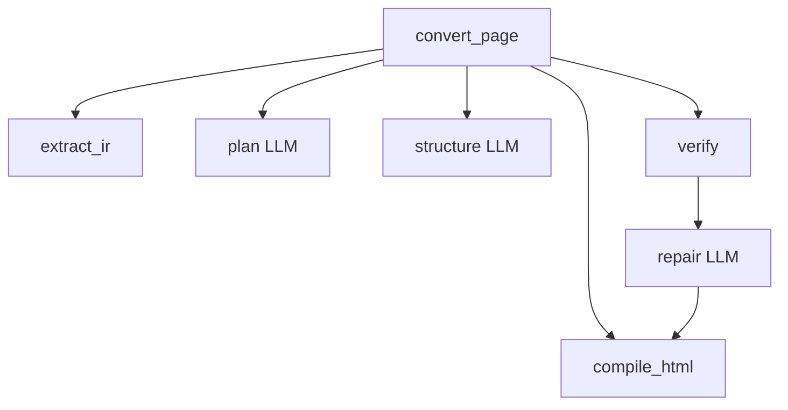

# P0b — Observability + local bridge stub

**Goal:** Live-debug convert/agent steps in Langfuse; keep `.runs/` artifacts; stand up **plugin ↔ localhost agent** bridge (no Figma MCP).  
**Depends on:** P0 smoke at least (D0.3+); full P0 gate preferred before heavy agent work.  
**Unlocks:** Safe P3 debugging + live ingest from Figma Desktop.  
**Stack:** Langfuse TS SDK, OpenRouter hello call, `ws` / HTTP server. See [STACK.md](./STACK.md) · [LOCAL-BRIDGE.md](./LOCAL-BRIDGE.md).

---

## Phase gate

### PASS — all must be true

- [ ] Stub or real convert pipeline emits **nested** traces in Langfuse UI
- [ ] Spans include non-LLM steps: compile, verify (not only chat)
- [ ] LLM spans show model id, role, prompt/completion, tokens (keys redacted)
- [ ] `.runs/<run_id>/` written and linked from trace metadata
- [ ] Debug runbook: fail → Langfuse → `.runs` in &lt;2 minutes
- [ ] Agent `GET /health` reachable from plugin via `devAllowedDomains`
- [ ] Plugin can `POST /ingest` (or WS `selection`) with JSON_REST snapshot; agent stores under `.runs/`
- [ ] No Figma PAT / MCP required for ingest

### FAIL — stay in P0b if any true

- [ ] Only flat OpenRouter/Helicone request logs (no parent tree)
- [ ] Cannot see which step failed without reading terminal scrollback
- [ ] Tracing requires Python Langfuse SDK
- [ ] Secrets (API keys) appear in trace payloads
- [ ] Live path depends on Figma REST/MCP
- [ ] Localhost blocked (manifest missing `devAllowedDomains`)
- [ ] Selection ingest triggers OpenRouter spend without explicit convert

---

## Span map (canonical names)

Use these names from day one so P3 dashboards stay stable:

| Span           | Type       | Attributes (min)                 |
| -------------- | ---------- | -------------------------------- |
| `convert_page` | root       | `fixture_id`, `run_id`           |
| `extract_ir`   | span       | node counts                      |
| `plan`         | generation | `role=planner`, model            |
| `structure`    | generation | `role=structurer`, model         |
| `compile_html` | span       | output bytes, inline%            |
| `verify`       | span       | geometry/style/screenshot scores |
| `repair`       | generation | `role=repairer`, iter index      |
| `json_fix`     | generation | `role=json_fixer`                |



---

## Days

### D0b.1 — Langfuse TS hello

**Work (detail):**

1. `pnpm add @langfuse/tracing @langfuse/otel @opentelemetry/sdk-node`.
2. Create `scripts/trace-hello.ts`:
   - Init `NodeSDK` + `LangfuseSpanProcessor`
   - One `startActiveObservation("hello", …)`
   - `forceFlush` before exit
3. Set env vars; confirm cloud (or Docker self-host) shows the trace.
4. Document env in `.env.example` (no secrets committed).

**PASS:**

- [ ] Trace visible in Langfuse within ~10s
- [ ] No Python involved

**FAIL:**

- [ ] Trace never appears / wrong project
- [ ] Blocked on Python SDK docs only

---

### D0b.2 — Span map on stub pipeline

**Work (detail):**

1. Implement stub functions matching span map (sleep or fake scores OK).
2. Nest observations correctly (parent `convert_page`).
3. Add Langfuse dashboard screenshot or saved filter URL to runbook.

**PASS:**

- [ ] UI tree matches span map
- [ ] Names exactly as table (stable)

**FAIL:**

- [ ] Flat sibling spans with no root
- [ ] Ad-hoc names that will break later

---

### D0b.3 — OpenRouter generation span + redaction

**Work (detail):**

1. One chat via `openai` client (`baseURL: https://openrouter.ai/api/v1`).
2. Use a **cheap** model role (`json_fixer` or flash-class) for the hello call.
3. Record `model`, `role`, usage; strip `Authorization` and key-like strings from attributes.
4. Extra headers recommended by OpenRouter (`HTTP-Referer`, `X-Title`) for app listing — optional.

**PASS:**

- [ ] Generation visible with I/O
- [ ] Key not in any attribute/body stored

**FAIL:**

- [ ] Empty generation spans
- [ ] Key leaked

---

### D0b.4 — `.runs/` folder + link

**Work (detail):**

1. Convention:

```text
.runs/<run_id>/
  meta.json          # fixture_id, models, git sha, timestamps
  ir.json            # may be stub
  decisions.json     # may be stub
  index.html
  verify.json
  diff.png           # optional
  trace_url.txt      # Langfuse link if available
```

2. Gitignore `.runs/` but keep `.runs/.gitkeep` or docs example.
3. Put `run_id` + relative path on root span metadata.
4. Write short `docs/plan/phases/runbook-debug.md` (or section in this file) for the fail→trace→artifacts loop.

**PASS:**

- [ ] One command creates run folder + Langfuse trace with same `run_id`
- [ ] Runbook steps verified once by hand

**FAIL:**

- [ ] Trace without artifacts or artifacts without id
- [ ] Runs committed accidentally with secrets

---

### D0b.5 — Agent server `/health` + manifest localhost

**Work (detail):**

1. Add `scripts/agent-server.ts` (or `packages/bridge`): listen `8787`, `GET /health` → `{ ok: true }`.
2. Update `manifest.json` with `devAllowedDomains` for `http://localhost:8787`, `http://127.0.0.1:8787`, and `ws://` variants ([LOCAL-BRIDGE.md](./LOCAL-BRIDGE.md)).
3. From plugin (main or UI), `fetch` health when user opens panel or clicks “Check agent”.
4. Show connected / disconnected in UI.

**PASS:**

- [ ] Health OK with server up; clear error with server down
- [ ] No Figma token involved
- [ ] CSP does not block localhost in Desktop with development plugin

**FAIL:**

- [ ] Network request blocked without documenting manifest fix
- [ ] Health only works from curl, not from plugin

---

### D0b.6 — Live ingest (selection → agent, no LLM)

**Work (detail):**

1. `POST /ingest` or WS `selection`: body includes `JSON_REST_V1` document (or selection roots), bounds map, meta.
2. Debounce `selectionchange` (e.g. 300–500ms); **do not** call OpenRouter.
3. Agent writes `.runs/<id>/raw.json` (+ bounds); returns `{ runId, receivedBytes }`.
4. Optional “Send selection” button for on-demand push.
5. Document: convert/OpenRouter is a later explicit action (P3/P5).

**PASS:**

- [ ] Changing selection updates agent-side file within ~1s when live mode on
- [ ] Ingest traced lightly (span `ingest`) without generation spans
- [ ] Confirm zero OpenRouter calls during browse-only

**FAIL:**

- [ ] Ingest bills OpenRouter
- [ ] Requires MCP
- [ ] Payload drop / silent fail with no UI error

---

## OpenRouter note for this phase

P0b only needs **one** model call to prove wiring. Prefer cheapest OpenRouter model. Multi-model roles are configured fully in P3; keep `agent.config.json` stub ready:

```json
{
  "openRouter": {
    "baseURL": "https://openrouter.ai/api/v1",
    "models": {
      "json_fixer": "google/gemini-2.5-flash"
    }
  }
}
```
