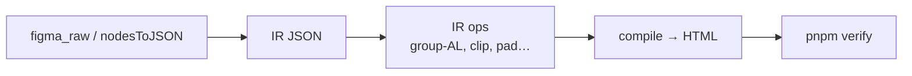

# P1 — IR extract and compile (no Figma mutate)

**Goal:** Design → serializable **IR** → HTML. Port tidy/layout knowledge to IR ops. Figma is read-only input via **plugin snapshots** (bridge or fixtures) — not MCP.  
**Depends on:** P0 phase PASS (baseline scores). P0b recommended (bridge ingest).  
**Unlocks:** P2.  
**Stack:** TS IR types (`zod` optional), adapters from plugin-pushed REST JSON / `nodesToJSON`, existing convert helpers, Playwright verify from P0. Bridge: [LOCAL-BRIDGE.md](./LOCAL-BRIDGE.md).

---

## Phase gate

### PASS — all must be true

- [ ] Corpus median verify score **≥ P0 baseline**
- [ ] CLI path: fixtures → IR → HTML **without** canvas tidy mutate / clone
- [ ] IR schema frozen as **v1** (documented breaking-change policy)
- [ ] Regression fixtures exist for GROUP-under-AL, image clip-vs-shadow, padding sanitize
- [ ] Leaf `absolute_escape` works without whole-page absolute

### FAIL — stay in P1 if any true

- [ ] Median score &lt; baseline − 5%
- [ ] Still need Figma “Tidy + Convert” mutate to match baseline
- [ ] IR cannot represent text segments or image fills needed for compile
- [ ] Escape flag absolutes the entire page

---

## IR design (approach)

**IR = JSON-serializable scene** with enough data to compile offline:

- Identity: `id`, `name`, `type`
- Box: `x`, `y`, `width`, `height` (parent-relative + optional absolute)
- Visual: fills, strokes, effects, opacity, radius, clips
- Text: characters, segments (font, size, weight, letterSpacing, lineHeight, fills)
- Layout hints from Figma: `layoutMode`, sizing, padding, gap, grid props
- Assets: image/SVG refs
- Flags: `absolute_escape`, `exportAsAsset`, etc.

**Do not** require live `SceneNode` at compile time.

---

## Days

### D1.1 — IR type sketch

**Work:** Define `IrNode` / `IrTextSegment` / `IrPaint` in TS. Optional Zod schemas mirroring types. Document invariants (e.g. children array always present). Hand-write minimal IR for one button+text.

**PASS:**

- [ ] Types compile in repo
- [ ] Hand IR validates (Zod or assert)
- [ ] Invariants documented

**FAIL:**

- [ ] Cannot express mixed text segments
- [ ] Types depend on Figma global `SceneNode`

---

### D1.2 — Extract adapter

**Work:** Map plugin-exported / bridge-ingested REST JSON (same shape as today’s enriched export) → IR. Stable sort children. Strip non-serializable fields. Dump `fixtures/<id>/ir.json`. Also accept `.runs/<id>/raw.json` from live ingest.

**PASS:**

- [ ] Two extracts of same fixture produce equal IR (or documented ignore fields)
- [ ] IR committed for fixture #1
- [ ] Live ingest file (if P0b done) converts to IR without Figma REST

**FAIL:**

- [ ] Random ids/order each run
- [ ] Loses image refs
- [ ] Extract requires MCP/PAT

---

### D1.3 — Thin IR → HTML compiler

**Work:** Walk IR; emit HTML using ported or wrapped existing builders where possible. Inline CSS OK temporarily. Wire assets paths like today’s ZIP. Run Playwright geometry on fixture #1.

**PASS:**

- [ ] Page opens; not blank
- [ ] Geometry score not catastrophic vs baseline (define floor, e.g. within 15% of baseline for #1)

**FAIL:**

- [ ] Missing all images
- [ ] Zero boxes match

---

### D1.4 — IR op: GROUP under Auto Layout

**Work:** Port rule: if group parent `layoutMode !== NONE`, keep as fixed box + absolute children (test5 `Div[main]` class). Add fixture that fails without op.

**PASS:**

- [ ] Regression fixture: sidebar + main stack, not sidebar|footer only
- [ ] Unit/IR snapshot shows kept box

**FAIL:**

- [ ] Flatten still hoists footer into horizontal flex with sidebar

---

### D1.5 — IR op: image fill layout box

**Work:** Port clipped-subset vs shadow-inflate for image/SVG layout boxes (`bg_route` class). Fixture with 1920 frame + clipped renderBounds.

**PASS:**

- [ ] No horizontal squash (width matches AABB when clipped)
- [ ] Shadow case still allowed to inflate (separate mini-fixture or unit)

**FAIL:**

- [ ] Squash regresses
- [ ] Shadow portraits clip wrongly

---

### D1.6 — IR op: padding sanitize

**Work:** Port ≥85% pad drop on an axis before emit. Fixture from HTML-import padding bombs.

**PASS:**

- [ ] Buttons/columns readable (content box not ~0)
- [ ] Normal section padding preserved on control fixture

**FAIL:**

- [ ] Bombs return
- [ ] Normal padding stripped

---

### D1.7 — Leaf absolute escape

**Work:** Flag on IR subtree forces absolute positioning for that subtree only during compile. Test with siblings remaining flow.

**PASS:**

- [ ] Automated test: one child escapes; sibling still in flex/flow
- [ ] Documented when agent/compiler may set flag

**FAIL:**

- [ ] Setting one flag absolutes root

---

### D1.8 — CLI without mutate tidy

**Work:** `pnpm ir-convert --fixture <id>`: load raw/baseline inputs → extract → ops → compile → write `.runs/`. No plugin tidy clone API.

**PASS:**

- [ ] 10 fixtures score ≈ mutate path (≥ or within 2% median of those 10’s P0 scores)
- [ ] Zero Figma UI automation required

**FAIL:**

- [ ] Hidden dependency on tidied Figma file only
- [ ] Scores collapse vs baseline HTML

---

### D1.9 — Full corpus on IR path

**Work:** Run all 30; triage top systematic fails; fix ops or compiler; update scoreboard `ir-v1`.

**PASS:**

- [ ] Median ≥ P0 baseline
- [ ] Top 5 fails documented with owners (op vs compiler vs fixture bounds)

**FAIL:**

- [ ] Median &lt; baseline − 5%
- [ ] Unknown mass failure

---

### D1.10 — Phase gate + schema freeze

**Work:** Tag `ir-schema-v1`; changelog note vs mutate tidy remaining gaps; fill phase PASS checklist.

**PASS:**

- [ ] All phase PASS boxes checked
- [ ] Schema version in IR `meta.schemaVersion`

**FAIL:**

- [ ] “We’ll fix schema later” while P2 starts
- [ ] Undocumented divergences

---

## Relation to current codebase

Keep valuable logic from `src/convert/nodes/toJson.ts`, `generate.ts` (imageFillLayoutNode), `padding.ts`, etc. — **port as IR ops / compile**, do not re-derive via LLM.
