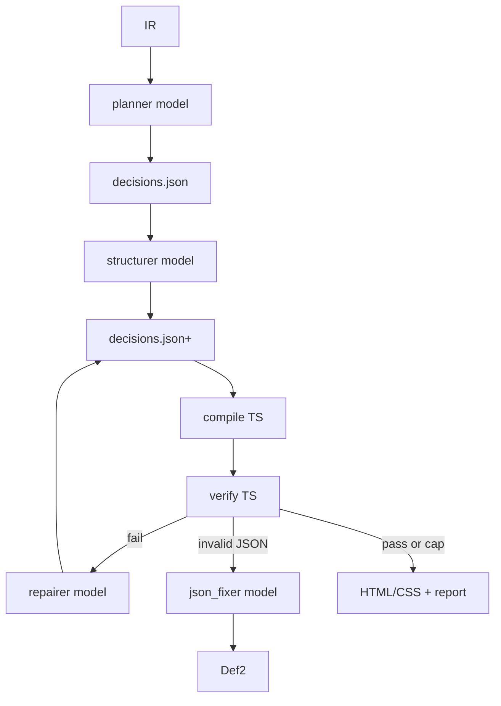

# P3 — Decision agent (OpenRouter multi-model)

**Goal:** Agent plans and repairs **decisions**; TypeScript compiler emits HTML/CSS; verify loop grades; Langfuse shows the tree. Live design data arrives via **plugin ↔ localhost bridge** (or fixtures in CI)—not Figma MCP.  
**Depends on:** P2 PASS, P0b PASS (including bridge ingest).  
**Unlocks:** P4, P5.  
**Stack:** `openai` → OpenRouter; roles in config; Langfuse spans; P0 verify; P1/P2 compile; [LOCAL-BRIDGE.md](./LOCAL-BRIDGE.md).

---

## Phase gate

### PASS — all must be true

- [ ] Fidelity median ≥ P2
- [ ] Structure metrics improve (flow share and/or component compression) vs P2 absolute rate
- [ ] Median repair iterations ≤ 3; hard cap enforced
- [ ] ≥80% of fidelity fails map to a decision id in traces (spot-check n=10)
- [ ] Agent never writes final CSS/HTML except via compiler inputs
- [ ] $/page and calls/page caps enforced and logged
- [ ] Same decisions JSON → identical HTML hash (compile determinism)

### FAIL — stay in P3 if any true

- [ ] Model patches CSS/HTML files directly to pass verify
- [ ] Unbounded repair loop or cost
- [ ] Non-deterministic compile with frozen decisions
- [ ] Absolute escape used as global cheat to inflate fidelity
- [ ] Traces lack role/model or repair lineage

---

## Architecture



**Central rule:** LLM output = decisions (+ optional names). HTML = pure function `compile(ir, decisions)`.

---

## OpenRouter multi-model setup

### Client

```ts
import OpenAI from "openai";

const client = new OpenAI({
  apiKey: process.env.OPENROUTER_API_KEY,
  baseURL: "https://openrouter.ai/api/v1",
  defaultHeaders: {
    "HTTP-Referer": "https://github.com/your/figma-to-code",
    "X-Title": "FigmaToCode Agent",
  },
});
```

### Role → model map

Config file (committed example without secrets): `agent.config.json`

| Role         | Responsibility                             | Output          |
| ------------ | ------------------------------------------ | --------------- |
| `planner`    | Section order, layout intent per container | decisions draft |
| `structurer` | Component/section names, prop hints        | patch names     |
| `repairer`   | Read verify fails → minimal decision patch | JSON patch      |
| `json_fixer` | Fix invalid JSON only                      | valid JSON      |
| `vision`     | Optional screenshot sectioning             | section bands   |
| `judge`      | Optional quality scores                    | scores          |

Pick concrete OpenRouter model IDs in config (Claude / GPT / Gemini classes). **Swap models without code changes.**

### Call policy

- Temperature 0–0.2; repairer/json_fixer at 0
- Max tokens capped per role
- On schema fail → `json_fixer` once → else abort iter
- Record `role` + `model` on every Langfuse generation

---

## Decision schema (minimum)

Per node (or per container id):

```json
{
  "nodeId": "658:960",
  "layout": "flex_column" | "flex_row" | "grid" | "absolute" | "absolute_escape",
  "order": 0,
  "component": "Card" | null,
  "notes": "optional short rationale"
}
```

Root: `{ "schemaVersion": 1, "sections": [...], "nodes": [...] }`.

Validate with Zod before compile.

---

## Days

### D3.1 — Decision schema + Zod

**Work:** Types, Zod schema, example `decisions.json` for one fixture, AJV/Zod validate CLI.

**PASS:**

- [ ] Valid sample; invalid sample rejected with clear errors
- [ ] Schema version field required

**FAIL:**

- [ ] Cannot express flex vs absolute vs escape
- [ ] No validation

---

### D3.2 — Compiler consumes decisions

**Work:** `compile(ir, decisions)` respects layout + order. Hand-edit decisions and see layout change. No LLM.

**PASS:**

- [ ] Documented before/after for one fixture
- [ ] Ignoring decisions file = explicit fail or “default decisions from IR hints”

**FAIL:**

- [ ] Decisions ignored
- [ ] Compiler calls OpenRouter

---

### D3.3 — Planner role call

**Work:** Build prompt: IR summary + screenshot optional + schema. `planner` model returns decisions. Trace span `plan`. Validate; compile.

**PASS:**

- [ ] Valid decisions ≥50% on 10 fixtures first try (pre-fixer)
- [ ] Trace shows planner model id

**FAIL:**

- [ ] Free-form prose without JSON
- [ ] Wrong model hard-coded in source

---

### D3.4 — `json_fixer` + schema gate

**Work:** Pipeline: parse → Zod fail → `json_fixer` with errors → re-validate → abort.

**PASS:**

- [ ] Invalid rate &lt;10% end-to-end on 10 fixtures
- [ ] Fixer traced as separate role

**FAIL:**

- [ ] Infinite fix loops
- [ ] Fixer invents nodes not in IR

---

### D3.5 — Verify scores on Langfuse

**Work:** After compile, run P0 verify; attach scores + top fails to `verify` span; link `.runs/`.

**PASS:**

- [ ] Failed run visible in Langfuse with scores
- [ ] `verify.json` on disk matches span attrs

**FAIL:**

- [ ] Scores only in terminal
- [ ] Mismatched run_ids

---

### D3.6 — Repair loop (cap 3)

**Work:** If score below threshold, `repairer` gets fail report + current decisions → JSON patch → merge → compile → verify. Cap 3. Budget check each iter.

**PASS:**

- [ ] ≥3 fixtures improve within 3 iters
- [ ] Cap stops run; report lists residual fails
- [ ] No direct HTML writes

**FAIL:**

- [ ] Loop edits CSS
- [ ] Cap missing

---

### D3.7 — Credit assignment

**Work:** Each geometry/style fail includes `nodeId` → resolve `decisions.nodes[id]`. Prompt repairer with that slice. Trace links fail ↔ decision.

**PASS:**

- [ ] 5 random fails: human finds decision in &lt;2 min via Langfuse
- [ ] Repair prompt includes decision slice

**FAIL:**

- [ ] Only whole-file decisions dumped without localization

---

### D3.8 — Determinism

**Work:** Temperature 0; sort keys; freeze decisions in CI; hash HTML. Optional seed field in meta.

**PASS:**

- [ ] Identical decisions → identical HTML hash twice
- [ ] CI mode does not call planner (replay decisions)

**FAIL:**

- [ ] Hash drift with frozen decisions

---

### D3.9 — Structure metrics anti-cheat

**Work:** Track `% absolute_escape`, flow share, token coverage. Fail phase if escape rate skyrockets while fidelity ↑.

**PASS:**

- [ ] Metrics on scoreboard
- [ ] Threshold: escape rate must not exceed agreed ceiling (set after baseline week)

**FAIL:**

- [ ] Fidelity gaming via global absolute

---

### D3.10 — Full corpus agent runs

**Work:** Run all fixtures with caps; log cost; compare to P2 scoreboard.

**PASS:**

- [ ] Median fidelity ≥ P2
- [ ] Median iters ≤ 3
- [ ] Cost report checked in (aggregate, no secrets)

**FAIL:**

- [ ] Cost runaway
- [ ] Score regression

---

### D3.11 — Optional human checkpoint

**Work:** `--approve-plan` flag writes decisions and waits for file touch / CLI confirm.

**PASS:**

- [ ] Works when enabled; default auto for CI
- [ ] Traced as checkpoint span

**FAIL:**

- [ ] Blocks CI with no bypass

---

### D3.12 — Phase gate review

**Work:** Review 5 worst Langfuse traces; confirm roles used correctly; sign phase PASS.

**PASS:** All phase PASS boxes.  
**FAIL:** Any phase FAIL box.

---

## Multi-model experimentation

When comparing models:

1. Change only `agent.config.json` roles.
2. Re-run same 10-fixture pack.
3. Compare fidelity, iters, cost, invalid-JSON rate in Langfuse filters by `model`.

Do not fork prompts per vendor unless necessary — keep one prompt, many models.
