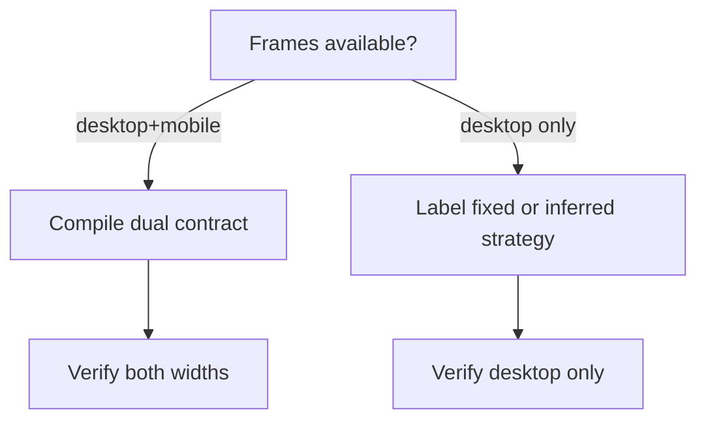

# P4 — Responsive + motion (declared)

**Goal:** Honest multi-width support and small motion presets — no fake “responsive from one desktop frame.”  
**Depends on:** P3 PASS.  
**Unlocks:** P5.  
**Stack:** Same compile/verify; dual `bounds` fixtures; CSS media queries or separate mobile stylesheet; `prefers-reduced-motion` in Playwright.

---

## Phase gate

### PASS — all must be true

- [ ] Desktop corpus score unchanged vs P3 (within noise)
- [ ] Dual-frame fixtures: mobile verify passes same ±2px/style contract
- [ ] Single-frame pages: report labels strategy as **inferred** or **fixed-width** — never “from Figma mobile”
- [ ] Motion opt-in; verify captures with reduced motion → no flake spike
- [ ] Decisions schema includes responsive + motion fields

### FAIL — stay in P4 if any true

- [ ] UI/docs claim responsive accuracy without mobile frame
- [ ] Desktop fidelity regresses to “add mobile”
- [ ] Animations make screenshot/geometry flaky in CI
- [ ] Inferred breakpoints written as if measured from design

---

## Approach

| Input                      | Behavior                                                                                                                      |
| -------------------------- | ----------------------------------------------------------------------------------------------------------------------------- |
| Desktop + mobile artboards | Map corresponding nodes; compile media queries / mobile rules from **both** bounds                                            |
| Desktop only               | Emit fixed width **or** named strategy from vocabulary (`stack-below-768`, `grid-3-to-1`, `collapse-sidebar`) marked inferred |
| Motion                     | CSS presets only (hover, simple section reveal); flags on decisions; no invented timeline from static Figma                   |



---

## Days

### D4.1 — Dual-frame fixture format

**Work:** Extend fixture contract:

```text
fixtures/<id>/
  bounds.desktop.json
  bounds.mobile.json      # optional
  design.desktop.png
  design.mobile.png       # optional
  meta.json               # widths: { desktop: 1440, mobile: 390 }
```

Document node pairing (same id, or `mobileOf` map).

**PASS:**

- [ ] One dual fixture complete + README
- [ ] `pnpm verify` supports `--width mobile`

**FAIL:**

- [ ] Ambiguous pairing
- [ ] Mobile bounds in wrong coordinate space

---

### D4.2 — Compile + verify mobile decisions

**Work:** Extend decisions:

```json
"responsive": {
  "mode": "dual_frame" | "inferred" | "fixed",
  "strategy": "stack-below-768" | null,
  "breakpointPx": 768
}
```

Compiler emits `@media` or `page.mobile.css`. Verify at mobile viewport width with mobile bounds.

**PASS:**

- [ ] Dual fixture passes desktop + mobile geometry gates
- [ ] Desktop-only fixtures still pass desktop

**FAIL:**

- [ ] Desktop score drops materially
- [ ] Mobile compile breaks asset paths

---

### D4.3 — Inferred strategy labeling

**Work:** When no mobile frame: planner/repairer may set `mode: inferred` + strategy from fixed vocabulary. ZIP `report.html` must show banner: “Responsive strategy inferred — not from a Figma mobile frame.”

**PASS:**

- [ ] Banner/report present
- [ ] Vocabulary enum validated (no free-form strings)

**FAIL:**

- [ ] Marketing copy says design-derived mobile
- [ ] Arbitrary breakpoint strings

---

### D4.4 — Motion presets

**Work:** CSS-only:

- `.motion-hover-lift` on buttons/cards
- `.motion-reveal` with `@media (prefers-reduced-motion: reduce) { animation: none }`

Playwright: emulate reduced motion before screenshot/geometry. Decisions: `motion: { hover: true, revealSections: true } | null` default null/off for verify stability.

**PASS:**

- [ ] Opt-in works visually in manual check
- [ ] CI verify flake rate not increased

**FAIL:**

- [ ] Motion on by default breaking diffs
- [ ] JS timeline required

---

### D4.5 — Phase gate

**Work:** Run corpus + dual fixtures; sign PASS checklist; update agent prompts so planner does not invent silent mobile.

**PASS:** All phase PASS boxes.  
**FAIL:** Any phase FAIL box.

---

## OpenRouter roles in P4

| Role       | Use                                                                                |
| ---------- | ---------------------------------------------------------------------------------- |
| `planner`  | May set inferred strategy **only** when no mobile frame; must set `mode` correctly |
| `vision`   | Optional pair desktop/mobile screenshots for section alignment hints               |
| `repairer` | Fix desktop/mobile decision mismatches from dual verify fails                      |

Still no model-emitted raw CSS — only decision fields → compiler.
