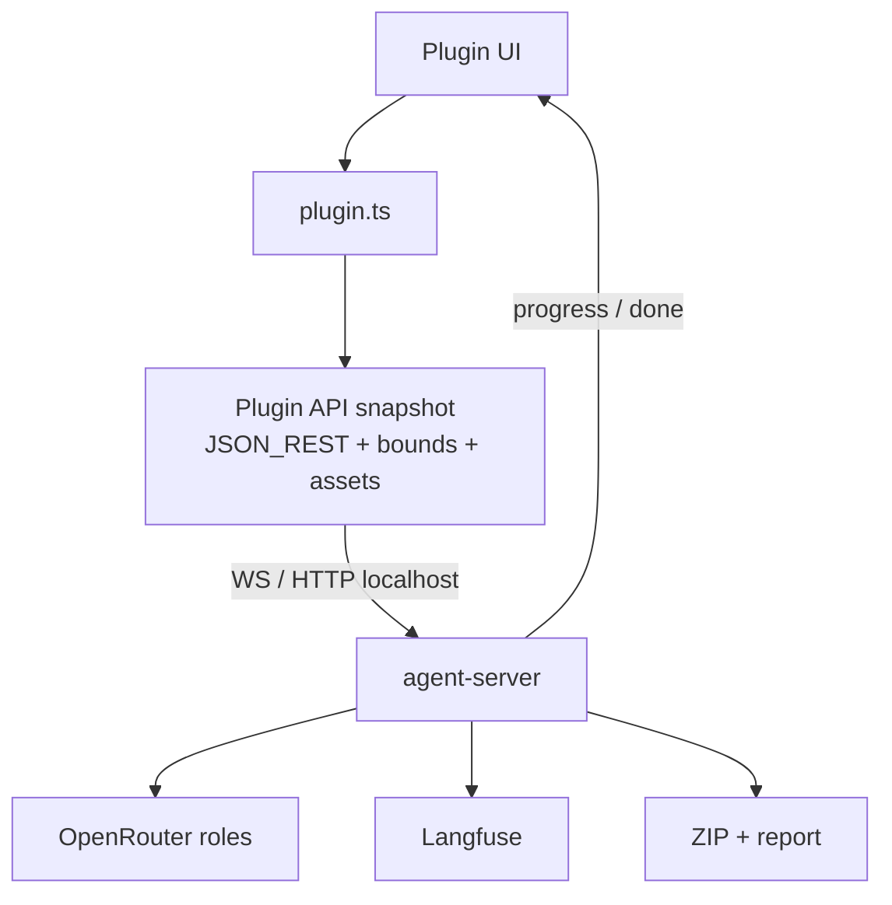

# P5 — Product ship (plugin + local agent bridge)

**Goal:** User-facing path: select in Figma → plugin ↔ **localhost agent** → ZIP with classed HTML/CSS + verify report; bounded cost; docs updated.  
**Depends on:** P3 PASS (P4 optional but recommended before marketing responsive); P0b bridge stub.  
**Unlocks:** v1 complete.  
**Stack:** Plugin + UI; [LOCAL-BRIDGE.md](./LOCAL-BRIDGE.md); OpenRouter multi-model; Langfuse; P0 verify.

---

## Phase gate

### PASS — all must be true

- [ ] Documented happy path: start `pnpm agent-server`, open plugin, Convert → ZIP
- [ ] Works for a non-author on a clean machine following docs
- [ ] ZIP includes `index.html`, `styles/*`, `assets/*`, `report.html`
- [ ] User sees stage progress over bridge (`plan` → `compile` → `verify` → `repair`)
- [ ] OpenRouter + Langfuse keys never appear in ZIP; Clear key works
- [ ] $/page and time caps enforced; runaway impossible in UI path
- [ ] Dogfood: 5 real pages meet desktop contract or show explicit escapes in report
- [ ] P0 corpus CI still green **without** Figma Desktop (fixtures only)
- [ ] Docs describe plugin↔agent bridge; **no** Figma MCP required
- [ ] Mutate-tidy not the only story

### FAIL — stay in P5 if any true

- [ ] Only works on author’s machine/paths
- [ ] Failures only in DevTools console
- [ ] Unbounded OpenRouter spend per click
- [ ] Keys leaked into artifacts/traces without redaction
- [ ] Users cannot tell PASS vs “shipped with known misses”
- [ ] Convert path requires Figma PAT / MCP
- [ ] Live selection auto-charges OpenRouter

---

## Topology for ship

**v1 honesty:** Agent runs on the user’s machine (or later a hosted worker with the **same** HTTP/WS contract). Plugin never runs Playwright. Hosted worker = v1.1+.

---

## Days

### D5.1 — Bridge convert API

**Work:** Finalize contract from [LOCAL-BRIDGE.md](./LOCAL-BRIDGE.md):

- `POST /convert` or WS `convert` with caps
- Response stream: `progress` → `done` / `error`
- Artifacts under `.runs/<runId>/` including zip path or file list

Plugin: “Convert with agent” only enabled when `/health` ok.

**PASS:**

- [ ] Contract frozen in repo + example payloads
- [ ] One click produces ZIP without manual file copy
- [ ] Fixture CLI still works offline (`pnpm agent-convert --fixture`)

**FAIL:**

- [ ] Undefined handoff
- [ ] Plugin claims in-sandbox verify
- [ ] MCP used in happy path

---

### D5.2 — Progress UI over bridge

**Work:** Map WS/HTTP progress `stage` to UI (same names as Langfuse spans). Show disconnect state if agent dies mid-run.

**PASS:**

- [ ] User sees plan / compile / verify / repair
- [ ] Error shows short reason + run id
- [ ] Cancel button calls `/runs/:id/cancel` (or WS cancel)

**FAIL:**

- [ ] Single spinner only
- [ ] Progress jumps to done while repair still runs

---

### D5.3 — ZIP + `report.html`

**Work:** Report includes PASS/FAIL, top misses, escapes, model roles used, run id, optional Langfuse link, responsive mode banner (P4), bridge mode note (“local agent”).

**PASS:**

- [ ] `report.html` enough without Langfuse
- [ ] ZIP structure matches P2 shape

**FAIL:**

- [ ] Empty/missing report
- [ ] Broken relative links

---

### D5.4 — Keys and settings

**Work:** OpenRouter key (existing UX); Langfuse keys for agent server via `.env` (preferred) or optional plugin forward. Redaction tests. Agent disconnected → clear CTA “Start agent-server”.

**PASS:**

- [ ] Convert with keys set; Clear disables; no keys in ZIP
- [ ] Traces redact secrets

**FAIL:**

- [ ] Key in HTML/ZIP
- [ ] Python sidecar required

---

### D5.5 — Dogfood + caps

**Work:** Enforce `maxUsd`, `maxRepairIters`, `maxWallMs` in agent server. Live ingest remains free. Dogfood 5 pages via real plugin↔bridge.

**PASS:**

- [ ] Caps trigger clean UI message
- [ ] 5 pages accepted or explicit escapes
- [ ] Cost summary in report

**FAIL:**

- [ ] Infinite spinner / bill shock
- [ ] Selection browsing spends tokens

---

### D5.6 — Docs and narrative

**Work:**

- Update [logic.md](../../logic.md): plugin ↔ local agent UX
- README points to `docs/plan/phases/` + bridge
- Mark [plan-verified-agent.md](../plan-verified-agent.md) implementation path
- Explicit “We do not use Figma MCP for convert” note
- Retire mutate-tidy as default story (legacy optional)

**PASS:**

- [ ] New contributor: install → agent-server → plugin → convert
- [ ] Phase gate complete → **v1 complete**

**FAIL:**

- [ ] Docs still say MCP or mutate-tidy only
- [ ] Only author knows the real steps

---

## OpenRouter at ship

| Setting            | Ship default                        |
| ------------------ | ----------------------------------- |
| Multi-model config | `agent.config.json` on agent server |
| Planner / repairer | Stronger models                     |
| json_fixer         | Cheap/fast                          |
| Vision             | Off unless enabled                  |
| Judge              | CI only                             |

Show which models ran in `report.html`. Transport stays plugin ↔ localhost regardless of model choice.
