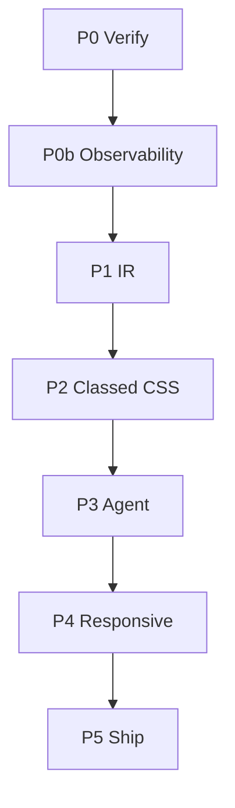

# Phases index — verified design→code agent

Companion to [../plan-verified-agent.md](../plan-verified-agent.md).

This folder is the **day-by-day build plan**. Root notes live here. Each phase is its own file with detailed tasks and PASS/FAIL switches.

**System logic diagram (single source):** [FLOW.md](./FLOW.md)

---

## How to use

1. Read **Root notes** (this file) once — stack, OpenRouter models, repo layout.
2. Open the **current phase** file. Do days in order (`D0.1` → `D0.2` …).
3. A day is done only when its **PASS** checklist is true. On **FAIL**, stay on that day (or add `D*.Xa` blocker day). Do not skip ahead.
4. A **phase gate** must PASS before starting the next phase’s first day.

---

## Phase map



| Phase | File                                           | Goal                                                   |
| ----- | ---------------------------------------------- | ------------------------------------------------------ |
| P0    | [P0-verify.md](./P0-verify.md)                 | Corpus + Playwright verify oracle                      |
| P0b   | [P0b-observability.md](./P0b-observability.md) | Langfuse traces + `.runs/` + **localhost bridge stub** |
| P1    | [P1-ir.md](./P1-ir.md)                         | IR extract/compile; no Figma mutate tidy               |
| P2    | [P2-classed-css.md](./P2-classed-css.md)       | Tokens + classed HTML/CSS                              |
| P3    | [P3-agent.md](./P3-agent.md)                   | Decision agent + repair via OpenRouter                 |
| P4    | [P4-responsive.md](./P4-responsive.md)         | Declared mobile + motion                               |
| P5    | [P5-ship.md](./P5-ship.md)                     | Plugin UX over bridge, ZIP, report                     |

Shared: [STACK.md](./STACK.md) · [LOCAL-BRIDGE.md](./LOCAL-BRIDGE.md) · [FLOW.md](./FLOW.md) (all-in-one diagram).

---

## Root notes — product rules

| Rule              | Meaning                                                                                   |
| ----------------- | ----------------------------------------------------------------------------------------- |
| **Language**      | TypeScript / Node 20+ only on the critical path. No Python.                               |
| **Output v1**     | Semantic HTML + CSS variables + class files (not React, not Tailwind-first).              |
| **Agent rule**    | LLM edits **decision records** only. Compiler is deterministic.                           |
| **Verify rule**   | Geometry + computed style primary; screenshot diff secondary.                             |
| **Figma access**  | **Plugin API only** for live design data. No Figma MCP / REST token on the critical path. |
| **Figma role**    | Input sensor via plugin. Do not mutate canvas as the tidy IR long-term.                   |
| **Runtime split** | Plugin ↔ **localhost bridge** ↔ Node agent (verify, OpenRouter, Langfuse, ZIP).           |

Live selection can stream snapshots anytime; **OpenRouter convert stays explicit** (user click). Full picture: [FLOW.md](./FLOW.md). Bridge details: [LOCAL-BRIDGE.md](./LOCAL-BRIDGE.md).

---

## OpenRouter — multi-model policy

All LLM traffic goes through **OpenRouter** (`https://openrouter.ai/api/v1`) using the OpenAI-compatible client (`openai` npm package, `baseURL` set to OpenRouter).

### Roles (assign models in config; swap without code changes)

| Role           | Job                                                   | Suggested class (pick concrete IDs in config)                                       | Temp  |
| -------------- | ----------------------------------------------------- | ----------------------------------------------------------------------------------- | ----- |
| **planner**    | Sections, reading order, high-level decisions         | Strong reasoning / long context (e.g. Claude Sonnet / Opus class, or GPT-4.1 class) | 0–0.2 |
| **structurer** | Component names, prop boundaries, token naming        | Mid-strong, good at JSON schema                                                     | 0–0.2 |
| **repairer**   | Patch decisions from verify fail report               | Same as planner or slightly cheaper                                                 | 0     |
| **json_fixer** | Repair invalid JSON only                              | Fast/cheap (e.g. Gemini Flash / GPT-4o-mini class)                                  | 0     |
| **vision**     | Optional: section from screenshot                     | Multimodal OpenRouter model                                                         | 0–0.2 |
| **judge**      | Optional: LLM-as-judge on edit-success / plan quality | Separate from planner to reduce bias                                                | 0     |

Store in e.g. `agent.config.json`:

```json
{
  "openRouter": {
    "baseURL": "https://openrouter.ai/api/v1",
    "models": {
      "planner": "anthropic/claude-sonnet-4",
      "structurer": "openai/gpt-4.1",
      "repairer": "anthropic/claude-sonnet-4",
      "json_fixer": "google/gemini-2.5-flash",
      "vision": "openai/gpt-4.1",
      "judge": "openai/gpt-4.1-mini"
    }
  }
}
```

Concrete model slugs change often — **config is source of truth**, docs name roles.

### Hard rules for OpenRouter usage

- Log every call to Langfuse with `model`, `role`, tokens, cost, latency.
- Cap **$/page** and **calls/page** (enforce in P3/P5).
- Prefer `response_format` / JSON schema when the model supports it; else validate + `json_fixer`.
- Never put API keys in ZIP or fixtures.

---

## Suggested package layout (target)

```text
packages/
  ir/           # IR types + extract adapters
  compile/      # IR + decisions → HTML/CSS
  verify/       # Playwright scorers
  agent/        # OpenRouter roles + repair loop
  bridge/       # localhost HTTP/WS server (plugin ↔ agent)
  trace/        # Langfuse / OTel helpers
fixtures/       # design.png, bounds.json, baseline/
.runs/          # gitignored run artifacts
scripts/        # tsx CLIs: verify, agent-server, agent-convert, …
```

Monorepo optional; folders under `src/` are fine for early days if faster — migrate when P1 starts.

---

## Definition of v1 complete

1. Desktop fidelity contract on corpus (or localized absolute escapes).
2. Classed HTML/CSS with measurable edit-success.
3. Agent path traced (Langfuse) + `.runs/`.
4. Plugin delivers ZIP + human-readable report.
5. All of the above in **TypeScript**.
