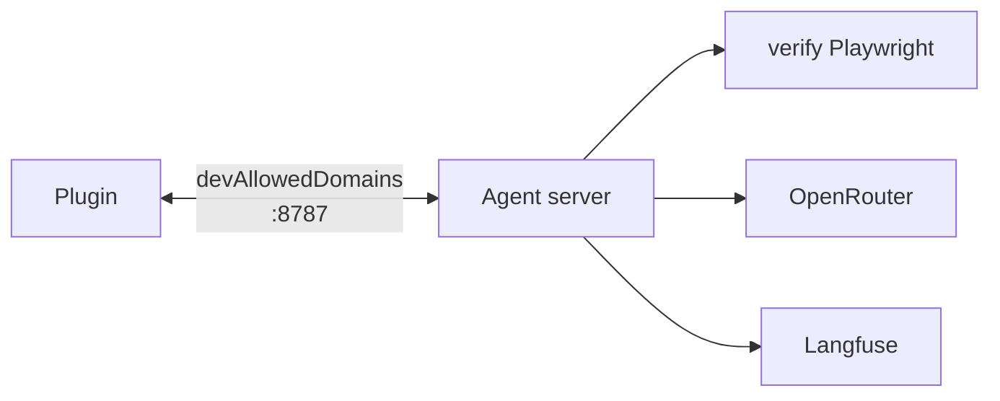
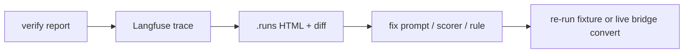

# STACK — TypeScript toolchain, SDKs, tools

Everything on the critical path is **Node 20+ / TypeScript**. No Python.  
**Figma data path:** Plugin API ↔ localhost bridge — see [LOCAL-BRIDGE.md](./LOCAL-BRIDGE.md). **Not** Figma MCP/REST.

---

## Runtime topology

| Process                                     | Runs                                                                          | Does not run                                              |
| ------------------------------------------- | ----------------------------------------------------------------------------- | --------------------------------------------------------- |
| **Figma plugin** (`dist/code.js` + UI)      | Plugin API read/export, push to localhost, progress UX, keys in clientStorage | Playwright, Langfuse Node SDK, OpenRouter multi-step loop |
| **Node agent server** (`pnpm agent-server`) | HTTP/WS bridge, compile, verify, OpenRouter, Langfuse, ZIP                    | Figma Plugin API (receives snapshots only)                |
| **CI / fixtures**                           | Same compile+verify from disk                                                 | Bridge / Figma Desktop                                    |

---

## Core npm packages

### Local bridge (P0b / P5)

| Package                            | Use                                                    |
| ---------------------------------- | ------------------------------------------------------ |
| `ws`                               | WebSocket server for realtime selection + progress     |
| `hono` or `fastify` or `node:http` | `GET /health`, `POST /ingest`, `POST /convert`         |
| Plugin `fetch` / `WebSocket`       | Allowed via `manifest.networkAccess.devAllowedDomains` |

Env: `AGENT_BRIDGE_PORT=8787` (optional `AGENT_BRIDGE_TOKEN`).

### Verify (P0)

| Package            | Use                                                      |
| ------------------ | -------------------------------------------------------- |
| `playwright`       | Chromium; load HTML; `getBoundingClientRect`; screenshot |
| `pixelmatch`       | PNG pixel diff (secondary signal)                        |
| `pngjs`            | Encode/decode PNG for pixelmatch                         |
| `sharp` (optional) | Resize/normalize screenshots before diff                 |
| `tsx`              | Run TS CLIs without separate emit step                   |
| `zod` (optional)   | Validate `bounds.json` / reports / bridge payloads       |

### Observability (P0b)

| Package                       | Use                                     |
| ----------------------------- | --------------------------------------- |
| `@langfuse/tracing`           | `startActiveObservation` / nested spans |
| `@langfuse/otel`              | `LangfuseSpanProcessor`                 |
| `@opentelemetry/sdk-node`     | NodeSDK hosting the processor           |
| `@langfuse/client` (optional) | Datasets / scores later                 |

Env: `LANGFUSE_PUBLIC_KEY`, `LANGFUSE_SECRET_KEY`, `LANGFUSE_BASE_URL` (cloud or self-host).

### LLM / agent (P3)

| Package                                 | Use                                                 |
| --------------------------------------- | --------------------------------------------------- |
| `openai`                                | OpenAI-compatible client → **OpenRouter** `baseURL` |
| `zod` + `zod-to-json-schema` (optional) | Decision schema → model JSON schema                 |

Env: `OPENROUTER_API_KEY` (plugin About and/or agent server env).

Optional: Helicone by proxy base URL — **not** a substitute for Langfuse agent trees.

### Compile / IR (P1–P2)

| Approach                  | Use                                |
| ------------------------- | ---------------------------------- |
| Existing `src/convert/**` | Port rules into IR ops / HTML emit |
| `postcss` (optional)      | Bundle/minify CSS in ZIP           |
| No React emitter in v1    | Keep static HTML                   |

### Plugin (existing)

| Package                      | Use                               |
| ---------------------------- | --------------------------------- |
| esbuild                      | `src/plugin.ts` → `dist/code.js`  |
| vite + React                 | UI                                |
| Existing OpenRouter key flow | `figma.clientStorage` + UI backup |

### Explicitly out of critical path

| Tool                     | Why not                                                                   |
| ------------------------ | ------------------------------------------------------------------------- |
| Figma MCP                | REST token, rate limits, plan caps; redundant with Plugin API for Desktop |
| Figma REST API           | Same limits; use only if a future IDE-without-plugin mode is required     |
| Python Langfuse / verify | TS SDKs cover tracing + Playwright                                        |

---

## Approaches (do / don’t)

| Do                                                    | Don’t                                                 |
| ----------------------------------------------------- | ----------------------------------------------------- |
| Plugin pushes live JSON/bounds/PNG to localhost       | Agent pulls Figma cloud with a PAT for normal convert |
| `devAllowedDomains` for localhost HTTP/WS             | Put `*` network access “for convenience”              |
| Live ingest free; convert on explicit click           | Auto-call OpenRouter on every `selectionchange`       |
| Multi-model OpenRouter via **role → model id** config | Hard-code one model in many call sites                |
| Trace every role call + compile + verify              | Only log final HTML                                   |
| Geometry/style verify first                           | Pixel-diff-only gates                                 |
| Decisions JSON as agent I/O                           | Let model rewrite CSS freely                          |
| Leaf `absolute_escape`                                | Whole-page absolute to chase score                    |
| Fixture-based CI without Figma                        | Eyeball-only QA                                       |

---

## Fidelity contract (v1 desktop)

At design artboard width, Chromium, fonts loaded:

- Mapped boxes within **±2px** of Figma bounds
- Colors / type / radii match IR (normalize color formats)
- Screenshot SSIM/pixelmatch is **advisory**

---

## Debug loop

---

## Version pins policy

Pin major versions in `package.json` when a phase starts using a package. Re-read OpenRouter model IDs quarterly — roles stay stable, slugs may change.
