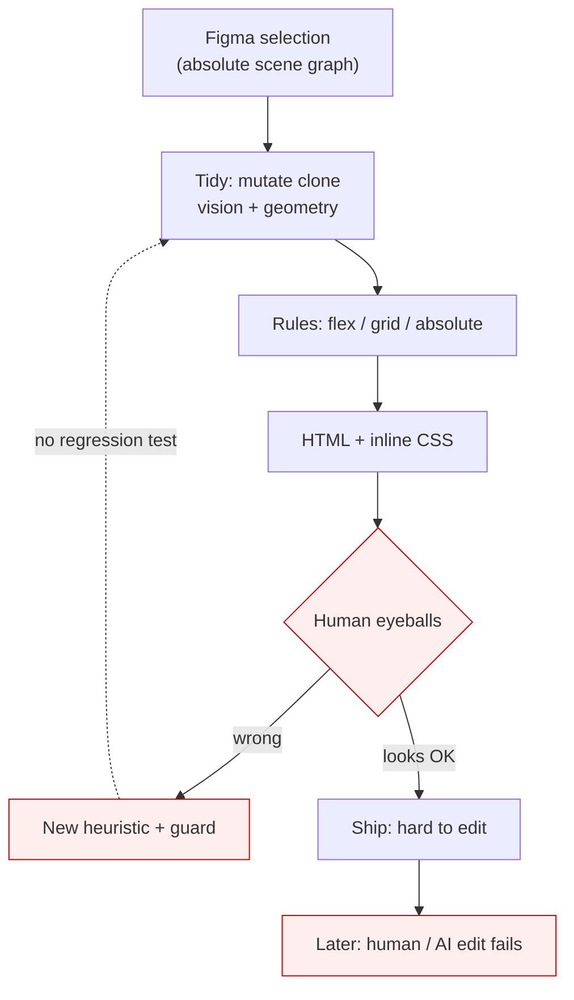
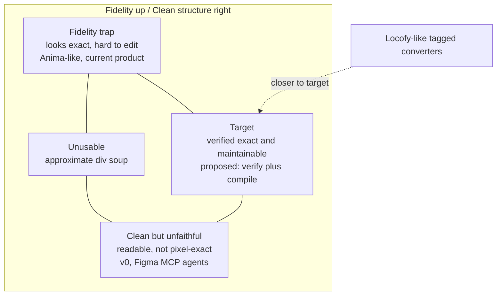
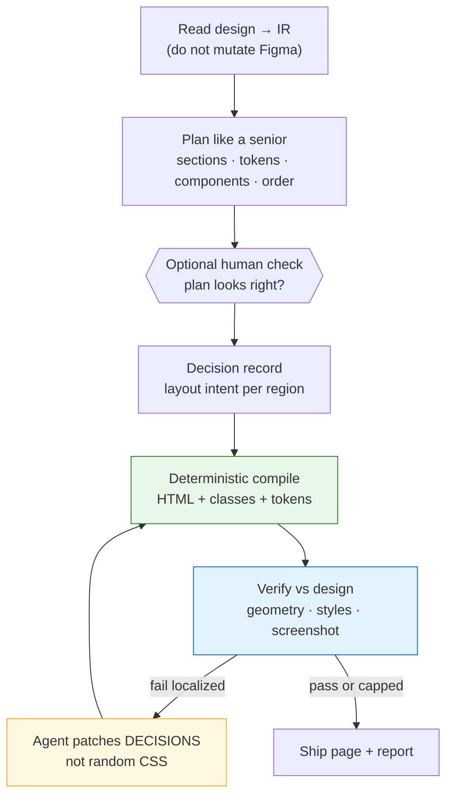
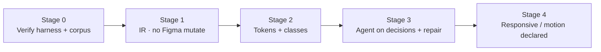

# Plan: From Open-Loop Conversion to a Verified Design→Code Agent

**Status:** proposal (argument, not a build checklist)  
**Scope:** one marketing / landing page, pixel-faithful at design width, maintainable enough for humans and AI editors to edit  
**Date:** 2026-09-29

---

## Thesis

The current product (AI tidies inside Figma → rules emit HTML with heavy inline CSS) fails for two **different** reasons that get mixed together:

1. **Fidelity fails** because the pipeline is **open-loop** — nothing measures “did the render match?”, so every bug becomes another heuristic.
2. **Maintainability fails** because the **emitter has no abstraction** (no tokens, classes, components) — even a perfect-looking page from a bad Figma tree is uneditable soup.

“Replace rules with a senior-coder AI agent” sounds like the fix. Industry evidence says that **alone** it is not: Figma MCP agents and v0-class tools already optimize for _plausible, clean-ish_ code and systematically miss exact spacing, tokens, and verification ([Figma: MCP vs agent](https://developers.figma.com/docs/figma-mcp-server/mcp-vs-agent/), [Builder on MCP limits](https://www.builder.io/blog/figma-mcp-server)). Teams closing the pixel gap in 2026 add a **measurement layer** (Playwright / screenshot diff / computed-style parity), not a smarter one-shot prompt ([Vadim, 2026](https://vadim.blog/pixel-perfect-playwright-figma-mcp/), [mcp-perfectpixel](https://github.com/hiimbomb1999/mcp-perfectpixel), [DesignDiff](https://github.com/Valkyrie2048/DesignDiff)).

**Working recommendation:** do **not** throw away the layout knowledge in today’s converter. **Do** retire “mutate Figma so the converter behaves” as the product center. Build a **decision record + deterministic compile + verify/repair** loop that imitates _how seniors work_ (plan → implement → check against the comps), not _how they vibe_.

**Build plan (day tasks, PASS/FAIL, TS stack, OpenRouter multi-model, plugin↔localhost bridge):** [phases/README.md](./phases/README.md) · [phases/LOCAL-BRIDGE.md](./phases/LOCAL-BRIDGE.md).

**Figma data:** Plugin API only on the critical path — not Figma MCP/REST (rate limits / paid API headroom).

---

## 1. Accurate problem diagnosis

### 1.1 Three failures (do not conflate)

| Class               | What breaks                                            | Root cause                                                | Wrong fix                                                  |
| ------------------- | ------------------------------------------------------ | --------------------------------------------------------- | ---------------------------------------------------------- |
| **Fidelity**        | Wrong size, squash, sidebar\|footer, missing décor     | Underconstrained Figma tree + no automated oracle         | “Add one more rule” forever                                |
| **Maintainability** | Inline CSS on every node; AI editors hallucinate edits | Emitter has no tokens / classes / components              | “Hope the model writes cleaner CSS” without a class system |
| **Process**         | Regressions invisible; fixes unlocalized               | No corpus, no evals, tidy mutates live Figma (hard to CI) | Bigger model, same open loop                               |

A **messy Figma file** makes structure hard. That is real. But **inline-everything emission** makes _any_ file unmaintainable. Fixing only the agent does not fix the emitter.

### 1.2 Why the current loop accretes heuristics

Figma is a **scene graph**, not a CSS document. Several layout interpretations can match pixels at one width and diverge elsewhere. Without a measured oracle, the team cannot tell whether a change helped. That is why “too many design cases” feels endless: the input space is unbounded and the fitness function is nostalgia for the last screenshot.

### 1.3 The user’s insight that _is_ correct

Senior developers do **not** dump the whole tree to DOM 1:1. They:

- Decide order (shell → sections → shared pieces → exceptions)
- Reuse components with small variants
- Choose responsive strategy deliberately
- Check the result against the design

That behavior is worth imitating. What seniors also do — and most AI Figma agents skip — is **verify**. Pixel-perfect without verify is marketing language; with verify it is an engineering contract.

---

## 2. What the industry is actually doing (2025–2026)

| Approach                                    | Optimizes                                           | Sacrifices                                                                                                                                                     | Lesson                                                           |
| ------------------------------------------- | --------------------------------------------------- | -------------------------------------------------------------------------------------------------------------------------------------------------------------- | ---------------------------------------------------------------- |
| **Figma MCP + coding agent**                | Access to structure + screenshot; fits IDE workflow | No render feedback; agent invents spacing/tokens ([Figma docs](https://developers.figma.com/docs/figma-mcp-server/mcp-vs-agent/))                              | Extraction is commoditizing — weak moat alone                    |
| **v0 / screenshot→code**                    | Speed, readable React/Tailwind                      | Exactness; “looks like” ≠ “matches comps”                                                                                                                      | Clean ≠ pixel-faithful                                           |
| **Locofy-class**                            | Component mapping when Figma is tagged/clean        | Needs hygiene; responsive still weak in practice                                                                                                               | Industry answered chaos with **annotation**, not magic inference |
| **Anima-class literal**                     | Fast visual prototype                               | Absolute/deep nesting; rewrite often cheaper than edit ([2026 agency comparisons](https://sitegrade.io/en/blog/figma-to-code-2026-tools-comparison-agencies/)) | Literal fidelity without structure is a dead end for maintenance |
| **Verify tools (Playwright + Figma image)** | Close the open loop                                 | Not generators — gates                                                                                                                                         | **Measurement is the missing product primitive**                 |

**Trend line:** generation quality rises; **verified fidelity is still rare**. Competing on “smarter one-shot from MCP” races a commodity. Competing on **measured match + editable structure** is still open.

**Counterargument to “go full agent”:** agents without a gate invent CSS, miss tokens, and create “coherent chaos” — each file locally fine, system incoherent ([AI debt analyses, 2026](https://letsbuildsolutions.com/blog/engineering-management/managing-ai-generated-technical-debt-a-practical-framework-for-teams-shipping-with-copilot-and-claude/)). Your own pain (“AI editors hallucinate on the soup”) will **worsen** if the agent emits free-form pages with no stable class/token handles.

---

## 3. What “senior imitation” must mean mechanically

Imitation is not one giant chat. It is a **phased pipeline** with artifacts seniors leave behind (even if only in their heads):

**Central rule (non-negotiable):**

> The agent edits the **decision record**. A **compiler** turns decisions into code. A **verifier** turns the render into localized failures. Repair patches decisions and recompiles — it does not free-edit the whole stylesheet.

That is how you get senior-like judgment **and** pixel arithmetic that models are bad at.

### Why pure agent fails here

1. LLMs are unreliable at exact layout numbers.
2. End-to-end generation has no credit assignment (“which choice broke the footer?”).
3. Non-determinism hurts repeat customers (two ZIPs, two structures).

### Why pure rules fail here

1. Intent is missing from the tree; rules are priors over designer habits.
2. Priors conflict; interaction surface grows faster than debugging capacity.
3. Inline emission never creates maintainability even when pixels win.

### Hybrid that works in adjacent fields

Compilers + verifiers + bounded search (or agents that propose candidates). Same shape here.

---

## 4. Proposed product architecture

### 4.1 Artifacts

| Artifact            | Role                                                                                            |
| ------------------- | ----------------------------------------------------------------------------------------------- |
| **IR**              | Serializable tree: boxes, paints, text, effects, assets, variables — read-only from Figma       |
| **Section map**     | Reading order, region roles (hero, nav, footer…)                                                |
| **Token set**       | Colors, type, spacing rhythm + coverage score                                                   |
| **Component map**   | Repeated subtrees → named components + props                                                    |
| **Decision record** | Per container: flex / grid / absolute / “escape absolute”; responsive strategy; motion defaults |
| **Compile output**  | Semantic HTML + **shared CSS** (tokens as variables, classes — not one style= per node)         |
| **Verify report**   | Per-section failures with magnitude                                                             |

### 4.2 Agent responsibilities (senior behaviors)

| Senior habit      | Agent / system job                                                                        |
| ----------------- | ----------------------------------------------------------------------------------------- |
| “What first?”     | Outside-in order: shell → sections → repeated cards → one-offs                            |
| “Same component?” | Structural match + Figma instances when present; model only **names** and prop boundaries |
| “How responsive?” | Require second artboard **or** pick a named strategy and label it as **inferred**         |
| “Animation?”      | Small declared library (hover, section reveal) — not invented motion from a static frame  |
| “Is it done?”     | Verify loop until contract met or local absolute fallback                                 |

### 4.3 Fidelity contract (write it down)

**In scope (v1):** at design artboard width, target browser, fonts available:

- Mapped boxes within **±2px** of Figma bounds
- Colors, radii, type properties match IR

**Out of scope (v1):** other breakpoints unless a second frame is supplied; subpixel / antialias noise; inventing product behavior (forms, CMS).

Without this, “pixel-perfect” is infinite scope.

### 4.4 Cleanliness must be scored too

If the verifier only rewards pixel match, the agent learns **absolute positioning everywhere** (the fidelity trap — upper-left of the quadrant chart). Score also:

- Share of flow vs absolute containers
- Token coverage of literals
- Duplicate compression (component induction)
- **Edit-success rate:** battery of tasks (“change brand color”, “add a card”) run through an LLM editor — this is the user’s real pain, made measurable

---

## 5. Feasibility and hard limits (clear-headed)

| Claim                                                    | Verdict                                                                  |
| -------------------------------------------------------- | ------------------------------------------------------------------------ |
| One agent chat replaces tidy + rules                     | **No** — needs IR, compile, verify                                       |
| Agent can invent mobile from one 1440 frame              | **No** — that is guessing; label or require mobile frame                 |
| Agent can match Locofy without any design hygiene        | **Unlikely** — market leaders still need Auto Layout / components / tags |
| Keep all current rules forever as if-else on Figma nodes | **No** — port as **hypothesis generators / scorers** on IR               |
| Drop rules and trust the model for CSS                   | **No** — precision dies                                                  |
| Verification first, agent later                          | **Yes** — highest leverage; useful even if agent is delayed              |
| Mutating Figma as the tidy IR                            | **Retire** — blocks CI, fixtures, bisect                                 |

**Information ceiling:** a senior knows the design system and other pages. One artboard does not. Better **inputs** (variables, instances, second frame, 3 structured questions) beat a larger model for structure.

---

## 6. What to do with the current product

| Piece                                                                                      | Action                                  | Why                                    |
| ------------------------------------------------------------------------------------------ | --------------------------------------- | -------------------------------------- |
| Layout rules (flex/grid/absolute, GROUP-under-AL, clip vs shadow boxes, padding sanitize…) | **Keep → port into compiler / scorers** | Hard-won; do not re-learn from a model |
| Vision sectioning                                                                          | **Keep**                                | Right use of AI (perceive regions)     |
| Tidy as Figma clone mutation                                                               | **Rewrite** to IR transforms            | Testable, replayable                   |
| Inline-only CSS emission                                                                   | **Rewrite**                             | Maintainability is emitter-side        |
| “AI’s job is fix the Figma file” framing                                                   | **Retire**                              | Wrong center of gravity                |
| Open-loop “eyeball QA”                                                                     | **Retire**                              | Replace with corpus + verify           |

---

## 7. Staged roadmap

| Stage | Deliverable                                                                               | Success criteria                                                     |
| ----- | ----------------------------------------------------------------------------------------- | -------------------------------------------------------------------- |
| **0** | Headless render of today’s output; geometry + style asserts; 30–50 real pages as fixtures | Every change gets a measured delta; first real fidelity baseline     |
| **1** | IR extract; tidy as IR ops; compile IR→HTML; leaf absolute fallback                       | Parity with today on corpus; pipeline runs without Figma UI in CI    |
| **2** | Tokens + class-based CSS; component induction v1                                          | Token coverage ↑; edit-success rate ↑ vs inline baseline             |
| **3** | Decision record; model proposes layout intent; bounded repair; 1–2 human checkpoints      | Fidelity ≥ Stage 1; cleaner structure scores; ≤3 repair iters median |
| **4** | Two-frame responsive or labeled strategies; small motion library                          | Mobile contract only when mobile frame exists                        |

**Do Stage 0 before any “agent rewrite.”** Without a fitness function, the new agent will hill-climb by anecdote the same way rules did.

---

## 8. Risks and anti-patterns

- Rewriting everything and losing years of layout edge cases
- Letting the model emit final layout CSS
- Unbounded repair loops (cost + oscillation)
- Pixel-diff as the **only** oracle (noisy → false repairs)
- Global absolute fallback when one subtree fails
- Silent inferred breakpoints marketed as “responsive”
- Competing only on extraction while Figma MCP commoditizes it

---

## 9. Open questions (research, not slogans)

1. Exact tolerances for geometry vs font/antialias noise on a real corpus
2. How often Figma **instances** already exist vs needing induction from one page
3. Can failures be mapped reliably to **decisions** (credit assignment)?
4. Does the repair loop converge within a fixed budget?
5. Hygiene distribution of target customers — absorb chaos, lint it, or refuse it?
6. Do buyers pay for **verified pixels** or for **clean enough to hand to a dev**? Those are different products

---

## 10. Conclusion

Your diagnosis of the **symptoms** is right: rule accretion cannot cover all Figma methods; pixel-faithful div soup is a maintenance trap; MCP-style agents alone trade exactness for vibes.

Your proposed **direction** (imitate senior workflow) is right only if seniors’ **verification and planning artifacts** are copied — not only their chatty improvisation.

The feasible path is not “AI agent instead of rules.” It is:

**IR + senior-style plan/decisions + deterministic compile to classed HTML + verify/repair**, with the current rules surviving as the compiler’s brain, and Figma mutation / inline-only emission retired.

That is harder than a prompt change and more likely to produce both **pixel-faithful** and **editable** one-page results — which is the actual goal.
